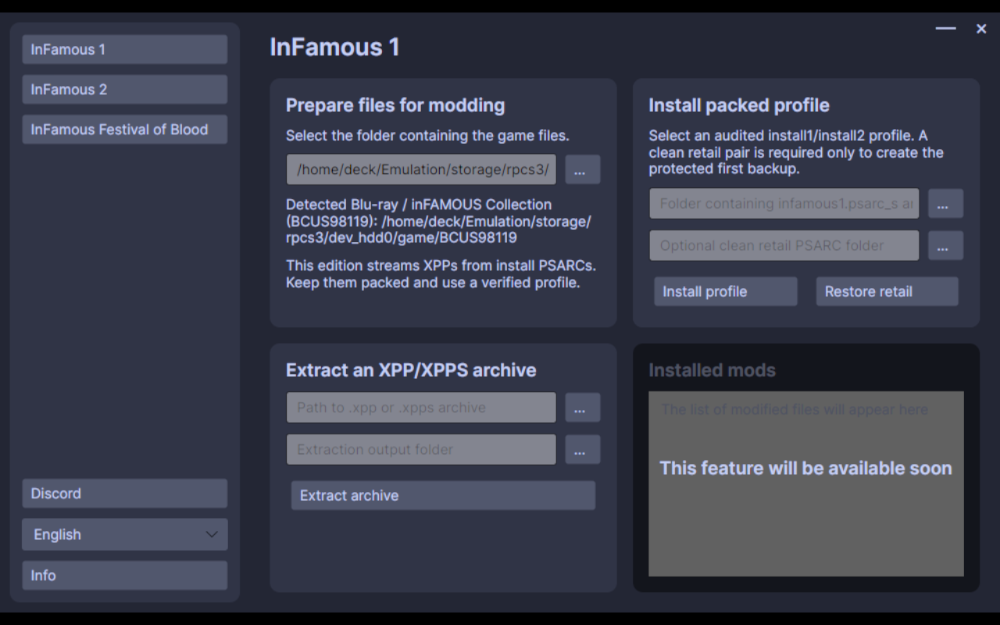

# Steam Deck foreground verification

## 2026-08-21 — BCUS98119 edition detection

The self-contained Linux x64 build from commit `4fa1fdb` was launched from the Steam Deck Game Mode shortcut `inFAMOUS XPP Mod Manager` (shortcut app ID `2260629975`, run-game ID `9709331811015852032`).

The 1280×800 foreground capture shows:

- the selected inFAMOUS 1 page;
- automatic detection of `Blu-ray / inFAMOUS Collection (BCUS98119)` under the configured RPCS3 `dev_hdd0/game` root;
- the packed-profile install and retail-restore controls;
- the packed-edition warning in place of the PSN loose-file unpack action.

Capture SHA-256: `ebe0f88a0ab81b6e18272598cb3a2925b9cad7d7fe1655e5c54474373836e3ad`  
Capture size: `327475` bytes

Ten one-second idle samples reported a stable `221764` KiB resident set (about 216.6 MiB). Process lifetime CPU moved from 3.6% to 3.4% while the page remained idle.

The same build passed nine automated tests. An optional integration test also inspected the real protected retail PSARCs and the `a21one2x` profile: their 492-entry install1 and 1804-entry install2 manifests matched in full and both used 65536-byte blocks.
